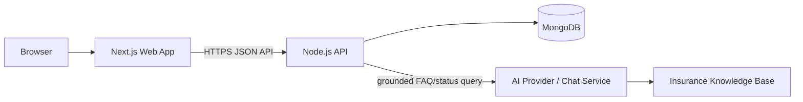
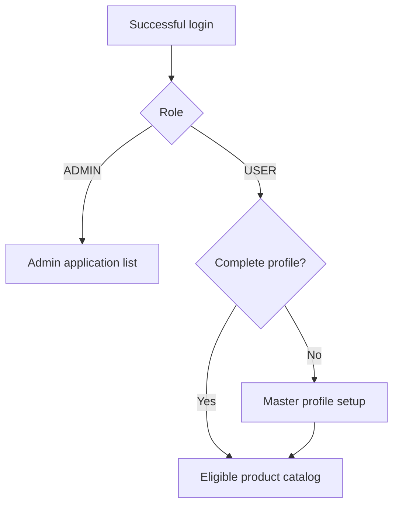
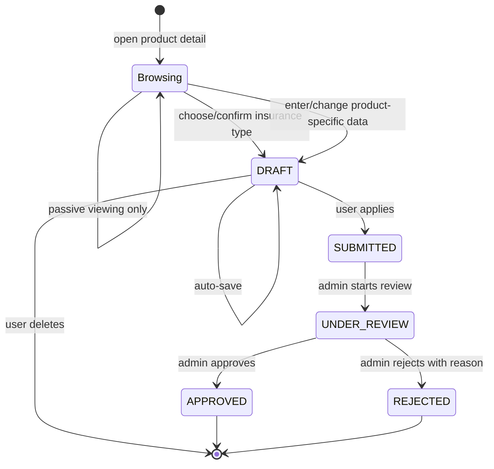
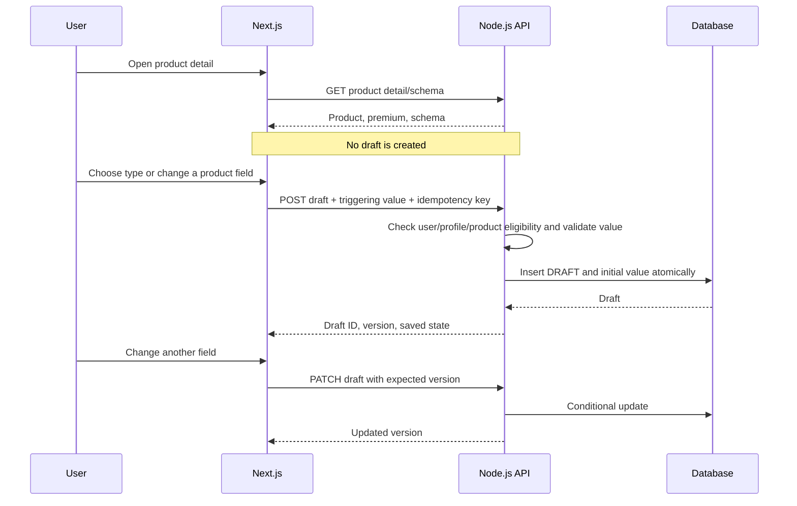
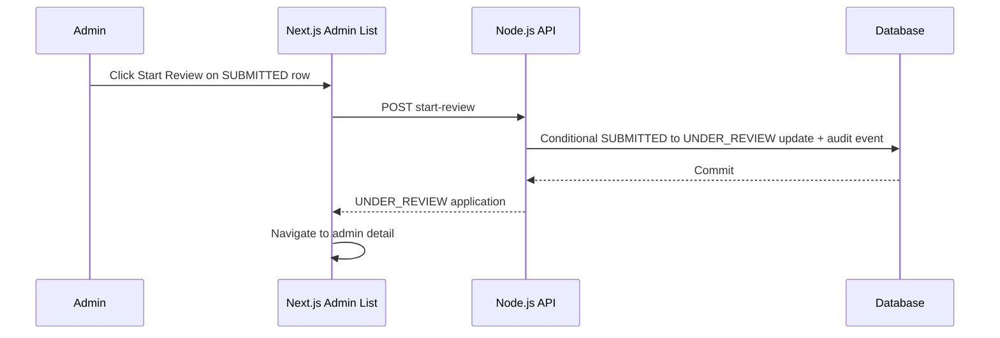

# Simple Insurance Application — System Design

## 1. Purpose

This document converts the approved application flow into an implementable design for a Next.js frontend and Node.js backend. It must be read together with `rules.md`, which remains authoritative for business flow and permissions.

Source material:

- `docs/Simple_Insurance_App_FSD.docx`
- `docs/Simple_Insurance_App_Mini_BRD_Refined_Draft.docx`
- `docs/Mockup_Insurance.drawio.png`
- `rules.md`

If this design conflicts with `rules.md`, update the design; do not silently weaken a rule.

## 2. Design goals

- Guide a user from profile registration to eligible product discovery and application.
- Calculate and display premiums from the user's profile and product configuration.
- Preserve application work only after the user performs a meaningful action on the product application page.
- Enforce the lifecycle `DRAFT → SUBMITTED → UNDER_REVIEW → APPROVED | REJECTED`.
- Keep all authorization, premium, eligibility, validation, and transition decisions authoritative in Node.js.
- Support dynamic product-specific fields without shipping product rules as frontend code.
- Prevent duplicate drafts/submissions and conflicting admin decisions.
- Keep submitted application history stable when a profile or product changes later.

## 3. Scope boundaries

Included:

- email/password login and role-based routing;
- user master profile;
- product filtering and premium simulation;
- product detail and dynamic application fields;
- draft creation, auto-save, resume, deletion, and submission;
- user application progress;
- admin queue, profile/detail views, review, approval, and rejection;
- user-facing AI chatbot integration boundary.

Not defined by the source documents and therefore not designed as fixed business behavior:

- account verification, forgotten-password, and registration credential policy;
- exact insurance pricing, eligibility, currency, discount, and rounding values;
- payment collection after approval;
- underwriting integrations or automated underwriting;
- document upload, notifications, appeals, and reopening final decisions;
- the chatbot provider and knowledge-base implementation;
- retention/purge periods and regulatory policy.

## 4. Architecture



The application should be organized as a monorepo or two deployable applications sharing generated API types or a common contract package:

```text
frontend/ Next.js application
backend/ Node.js application
packages/
  contracts/    API DTOs, enums, and validation-compatible types
  config/       shared non-secret tooling configuration
```

This folder layout is recommended, not a requirement. Business domain code must not be imported directly from the backend into browser bundles.

### 4.1 Responsibility split

| Concern | Next.js | Node.js |
| --- | --- | --- |
| Page rendering and interaction | Primary | Supplies data |
| Form usability validation | Yes | Repeats authoritatively |
| Authentication session | Uses session | Creates and verifies session |
| Role/ownership authorization | Hides invalid actions | Authoritative enforcement |
| Product eligibility | Displays result | Authoritative calculation |
| Premium calculation | Displays result | Authoritative calculation |
| Dynamic field rendering | From returned schema | Supplies and validates schema |
| Draft trigger/autosave | Detects action and sends command | Creates/updates idempotently |
| Lifecycle transition | Requests action | Validates and commits atomically |
| Audit trail | Not authoritative | Records material events |
| Chatbot | Widget/UI | Scopes context and calls provider |

### 4.2 Next.js Server and Client Components

- Components in `frontend/app` and `frontend/components` are Server Components by default.
- Add `"use client"` only to the smallest interactive leaf that requires browser APIs, event handlers, local state, or effects.
- Keep data loading, authorization-aware rendering, and server-only dependencies in Server Components or the backend. Never expose secrets through Client Component props or bundles.
- The Phase 0 landing page and `Panel` are intentionally Server Components because they have no browser-side interaction. No Client Component boundary is needed yet.

### 4.3 Message queue decision

Phase 0 must not introduce a message broker. Its startup, health checks, migrations, and current HTTP behavior are synchronous, so a queue would add operational failure modes without providing delivery or scaling value.

Later phases may add a queue only for a concrete asynchronous requirement such as notifications or external integrations. Core application state transitions remain synchronous and authoritative in MongoDB. If a transition later publishes an event, use a transactional outbox so committing business state does not depend on the broker being available.

## 5. User experience and routes

### 5.1 Suggested routes

| Route | Role | Purpose |
| --- | --- | --- |
| `/login` | Public | Common user/admin login |
| `/profile/setup` | User | Create the required master profile |
| `/profile` | User | View or edit the master profile |
| `/products` | User | Eligible product catalog and premiums |
| `/products/[productId]` | User | Product detail and new application form |
| `/applications` | User | Draft and submitted application list |
| `/applications/[applicationId]` | User | Resume draft or view read-only progress |
| `/admin/applications` | Admin | Non-draft application queue |
| `/admin/applications/[applicationId]` | Admin | Read-only application review and actions |
| `/admin/users/[userId]` | Admin | Separate full master-profile view |

Route names may change, but their access boundaries and behavior must remain the same.

### 5.2 Post-login routing



The frontend may optimistically redirect, but it must obtain the role and profile-completion result from the authenticated backend session.

### 5.3 User application journey

1. The user completes age, sum assured, payment frequency, and payment method in the master profile.
2. The product catalog requests eligible products for the stored profile.
3. The backend filters products and returns premium simulations.
4. The user opens a product detail page. This read alone creates no application.
5. The user explicitly chooses/confirms an insurance type or changes an available product-specific field.
6. The frontend creates a draft with that triggering value in the same request.
7. Later changes auto-save to that draft.
8. Apply validates and submits the existing draft.
9. The user follows the application in a read-only progress view after submission.

For a product with no supplemental fields, the page must still require an explicit insurance-type/plan selection or confirmation. That interaction is the meaningful action that creates the draft; passive page opening is not.

## 6. Application lifecycle



No endpoint may implement a transition that is absent from this diagram.

### 6.1 Draft creation sequence



Frontend behavior before a draft exists:

- keep the triggering value locally while the creation request is pending;
- disable Apply until creation succeeds;
- queue or merge later edits rather than dropping them;
- show a retryable error if creation fails;
- do not claim the value is saved before the backend confirms it.

### 6.2 Submission sequence

```mermaid
sequenceDiagram
    participant U as User
    participant W as Next.js
    participant A as Node.js API
    participant D as Database

    U->>W: Click Apply
    W->>A: POST application submit + idempotency key
    A->>D: Load owned DRAFT and referenced product version
    A->>A: Re-check eligibility, premium, and required fields
    alt validation fails
        A-->>W: 422 field/domain errors
        W-->>U: Show errors; remain DRAFT
    else valid
        A->>D: Save snapshots, submittedAt, status SUBMITTED, audit event
        D-->>A: Commit
        A-->>W: Read-only submitted application
        W-->>U: Show Submitted progress
    end
```

The submission update and audit event must commit in one database transaction.

### 6.3 Admin review sequence

The Start Review control is placed on each `SUBMITTED` row of the Admin Application List. It performs the transition before navigating to the detail page:



Lifecycle changes require explicit command endpoints:

```text
SUBMITTED --Start Review--> UNDER_REVIEW
UNDER_REVIEW --Approve----> APPROVED
UNDER_REVIEW --Reject-----> REJECTED (non-blank reason required)
```

Each transition uses a conditional update on the expected current status. Zero updated rows means the state changed or the action was invalid, and the API returns `409 Conflict` with the current representation when safe.

Using a separate View action, directly opening the detail URL, or refreshing the detail page performs only a read and must not change status.

## 7. Frontend design

### 7.1 Shared application shell

- Authenticated user pages display navigation and the persistent chatbot launcher.
- Admin pages use a separate navigation shell and do not need the user chatbot.
- The shell retrieves the current account and role once per authenticated navigation boundary.
- Sensitive server data must not be embedded in client-visible configuration or logs.

### 7.2 Master profile form

Fields:

| Field | Control | Client validation |
| --- | --- | --- |
| Age | Numeric input | Required positive integer |
| Sum Assured | Currency/numeric input | Required positive decimal in configured currency |
| Payment Frequency | Select/radio | One canonical enum |
| Payment Method | Select/radio | `RECURRING` or `ONE_TIME` |

On successful save, invalidate profile and catalog data and route to `/products`. Server validation errors map to individual controls when possible.

### 7.3 Product catalog

Each card shows product name, insurance type, description, and premium simulation. The view must handle:

- loading;
- no compatible products;
- profile incomplete or invalid;
- profile changed and catalog refresh required;
- backend calculation failure.

The browser must not filter a broader hidden product list or calculate authoritative premiums itself.

### 7.4 Product detail/application form

The page has two conceptual states:

- `BROWSING`: product information and form schema loaded, no application ID exists;
- `DRAFT`: meaningful action succeeded and the API returned an application ID.

Displayed product information includes title, description, type/options, coverage, benefits, limitations, and premium. The form renderer maps only allow-listed schema field types to components; it must never execute code supplied by a schema.

Recommended supported schema primitives:

- text and multiline text;
- integer and decimal;
- date;
- boolean;
- single-select and multi-select.

Each field definition includes a stable `key`, label, type, required flag, allowed options where relevant, and declarative constraints. Product-specific definitions are business configuration and not fixed by this design.

### 7.5 Auto-save

- The type-selection event is saved immediately.
- Text-like input may be debounced; discrete choices may be saved immediately.
- Each PATCH sends the last known `version` for optimistic concurrency.
- A successful response replaces the local version.
- A `409` reloads/merges safely or asks the user to refresh; it must not overwrite a newer server value blindly.
- Navigation with unsaved or failed changes warns the user.

### 7.6 Application progress

| Status | Editable | Actions | Required visible data |
| --- | --- | --- | --- |
| `DRAFT` | Yes | Apply, Delete | Product details, entered data, premium |
| `SUBMITTED` | No | None | Submission date and submitted snapshot |
| `UNDER_REVIEW` | No | None | Submission date and reviewer when available |
| `APPROVED` | No | None | Approval date and approved status |
| `REJECTED` | No | None | Rejection date and reason |

### 7.7 Admin screens

The list requests only non-draft applications and shows Applicant Name, Date Applied, Insurance Type, Payment Frequency, and Status. Product name may also be shown. Its action column behaves as follows:

- `SUBMITTED`: Start Review and optional View;
- `UNDER_REVIEW`, `APPROVED`, or `REJECTED`: View only.

Start Review calls the transition endpoint. On success, Next.js navigates to the selected admin application detail page, which now renders `UNDER_REVIEW`.

The detail page displays the profile, product, submitted fields, premium snapshot, status history, reviewer, and decision data as read-only. Its action panel behaves as follows:

- `UNDER_REVIEW`: Approve and Reject;
- `SUBMITTED`, `APPROVED`, or `REJECTED`: no lifecycle actions.

A direct View of a `SUBMITTED` application does not change its status; the admin must return to the list and click Start Review.

Reject opens a reason form and disables confirmation until the trimmed value is non-empty. Backend validation remains mandatory.

## 8. Backend design

### 8.1 Suggested modules

```text
auth
users
profiles
products
rating
applications
admin-review
chat
audit
```

Dependencies should point toward domain services rather than from domain logic to HTTP handlers. Controllers parse requests; services enforce use cases; repositories handle persistence.

### 8.2 API conventions

- Base path: `/api/v1`.
- JSON request and response bodies.
- Stable string enums for role, frequency, method, and status.
- UTC timestamps formatted as ISO 8601.
- Currency amounts represented as integer minor units plus currency, or as validated decimal strings. Never return imprecise binary-float money.
- Every mutation accepts an idempotency key where retry could duplicate an operation.
- Validation errors use a stable structure containing a code, message, and optional field errors.
- Resources are always scoped by authenticated role and ownership before lookup results are exposed.

### 8.3 Proposed endpoints

Authentication:

| Method | Path | Purpose |
| --- | --- | --- |
| `POST` | `/api/v1/auth/login` | Authenticate and create session/token |
| `POST` | `/api/v1/auth/logout` | End session |
| `GET` | `/api/v1/me` | Current account, role, profile completion |

User profile and products:

| Method | Path | Purpose |
| --- | --- | --- |
| `GET` | `/api/v1/me/profile` | Get own master profile |
| `PUT` | `/api/v1/me/profile` | Create or replace validated profile |
| `GET` | `/api/v1/products` | Get products eligible for stored profile with premiums |
| `GET` | `/api/v1/products/:productId` | Get eligible product detail, premium, and field schema |

User applications:

| Method | Path | Purpose |
| --- | --- | --- |
| `GET` | `/api/v1/me/applications` | List own applications, including drafts |
| `POST` | `/api/v1/me/applications/drafts` | Create draft on first meaningful action |
| `GET` | `/api/v1/me/applications/:id` | Resume own draft or view progress |
| `PATCH` | `/api/v1/me/applications/:id/draft` | Auto-save owned draft fields/type |
| `DELETE` | `/api/v1/me/applications/:id/draft` | Delete owned draft only |
| `POST` | `/api/v1/me/applications/:id/submit` | Submit valid owned draft |

Admin:

| Method | Path | Purpose |
| --- | --- | --- |
| `GET` | `/api/v1/admin/applications` | List non-draft applications |
| `GET` | `/api/v1/admin/applications/:id` | Read combined application detail |
| `POST` | `/api/v1/admin/applications/:id/start-review` | `SUBMITTED → UNDER_REVIEW` |
| `POST` | `/api/v1/admin/applications/:id/approve` | `UNDER_REVIEW → APPROVED` |
| `POST` | `/api/v1/admin/applications/:id/reject` | `UNDER_REVIEW → REJECTED` with reason |
| `GET` | `/api/v1/admin/users/:userId/profile` | Read separate master-profile page |

Chat:

| Method | Path | Purpose |
| --- | --- | --- |
| `POST` | `/api/v1/chat/messages` | Answer a scoped, grounded user question |

Exact endpoint names may change. Separate command semantics and authorization rules may not.

### 8.4 Draft creation command

Example conceptual request:

```json
{
  "productId": "product-id",
  "productVersionId": "product-version-id",
  "trigger": {
    "kind": "INSURANCE_TYPE_SELECTED",
    "insuranceType": "HEALTH"
  }
}
```

Or, when the first action is a supplemental field:

```json
{
  "productId": "product-id",
  "productVersionId": "product-version-id",
  "trigger": {
    "kind": "SUPPLEMENTAL_FIELD_CHANGED",
    "fieldKey": "hasExistingDisease",
    "value": true
  }
}
```

The handler must reject an empty trigger. It validates that the trigger belongs to the current product schema, rechecks eligibility, calculates the premium, creates the draft, stores the first value, and records a creation event in one transaction.

### 8.5 Premium and eligibility service

Inputs:

- persisted master profile;
- active product version/rating configuration;
- selected insurance type where applicable;
- calculation timestamp.

Outputs:

- eligible/ineligible result with a safe reason code;
- premium amount and currency;
- rating/product version;
- calculation breakdown safe for display;
- quote/calculation timestamp and optional validity time.

Catalog, draft creation, and submission call the same domain service. Submission never trusts the premium sent by the browser.

### 8.6 Dynamic schema validation

The backend owns a versioned declarative schema for every product version. It must:

- return only UI-safe field metadata;
- validate required fields, data types, options, lengths, ranges, and formats;
- reject field keys not permitted by the selected product/version;
- preserve the schema version on the application;
- avoid evaluating user- or admin-supplied executable code.

## 9. MongoDB data design

### 9.1 Database technology and query language

- Database engine: MongoDB.
- Storage format: BSON documents.
- Database query language: MongoDB Query Language (MQL).
- Node.js access: the official MongoDB Node.js driver. An ODM may be added only if it preserves the MQL, index, validation, and transaction behavior in this design.
- Money storage: MongoDB `Decimal128` with an ISO currency code. API values are decimal strings and must not pass through JavaScript binary floating-point arithmetic.
- Identifier storage: MongoDB `ObjectId` internally and strings at the HTTP boundary.

MongoDB must run as a replica set, including as a single-node replica set in the Docker development/demo environment. This is required because submission and lifecycle commands update application, audit, and idempotency documents transactionally.

### 9.2 Collections

#### `users`

| Field | Notes |
| --- | --- |
| `_id` | ObjectId |
| `normalizedEmail` | Lowercase/normalized unique login identifier |
| `passwordHash` | Strong salted password hash |
| `role` | `USER` or `ADMIN` |
| `displayName` | Applicant/admin display name |
| `createdAt`, `updatedAt` | BSON UTC dates |

#### `masterProfiles`

| Field | Notes |
| --- | --- |
| `_id` | ObjectId |
| `userId` | Unique ObjectId reference to `users` |
| `age` | Positive integer |
| `sumAssured` | Positive `Decimal128` |
| `currency` | Configured ISO currency code |
| `paymentFrequency` | Canonical enum |
| `paymentMethod` | Canonical enum |
| `version` | Optimistic concurrency counter |
| `createdAt`, `updatedAt` | BSON UTC dates |

#### `products`

| Field | Notes |
| --- | --- |
| `_id` | Stable ObjectId product identity |
| `name` | Catalog title |
| `active` | Catalog availability |
| `createdAt`, `updatedAt` | BSON UTC dates |

#### `productVersions`

| Field | Notes |
| --- | --- |
| `_id`, `productId`, `version` | Version identity and product reference |
| `insuranceTypes` | Supported type values/options |
| `description` | Product description |
| `coverage`, `benefits`, `limitations` | Displayable structured/text content |
| `eligibilityConfig` | Validated age/sum-assured/payment compatibility |
| `ratingConfig` | Validated premium factors/discounts/rounding |
| `supplementalSchema` | Declarative versioned field schema |
| `effectiveFrom`, `effectiveTo` | Version applicability |

The product version is separate because submitted applications must retain an immutable version reference and snapshot even after the current catalog changes.

#### `applications`

| Field | Notes |
| --- | --- |
| `_id` | ObjectId |
| `userId` | Owning user's ObjectId |
| `productId`, `productVersionId` | Selected product/version references |
| `selectedInsuranceType` | Chosen type |
| `status` | Canonical lifecycle enum |
| `supplementalData` | Values validated against the versioned schema |
| `profileSnapshot` | Profile/rating inputs frozen at submission |
| `productSnapshot` | Product facts frozen at submission |
| `premiumSnapshot` | Decimal128 amount, currency, rating version/breakdown, and calculation time |
| `reviewerId` | Admin who started review; absent before review |
| `rejectionReason` | Required only for rejected applications |
| `version` | Optimistic concurrency counter |
| `createdAt`, `updatedAt` | BSON UTC dates |
| `submittedAt` | Present from Submitted onward |
| `reviewStartedAt` | Present from Under Review onward |
| `approvedAt` | Present only for Approved |
| `rejectedAt` | Present only for Rejected |
| `isDeleted` | Boolean; `false` for active records and `true` only after Draft deletion |
| `deletedAt` | Present only when `isDeleted` is `true` |

Snapshots may be absent or provisional in Draft, but must be fully populated and immutable after successful submission.

#### `applicationStatusEvents`

| Field | Notes |
| --- | --- |
| `_id`, `applicationId` | Event and parent ObjectIds |
| `fromStatus`, `toStatus` | Transition; draft creation has no prior status |
| `actorId`, `actorRole` | Who caused the event |
| `reason` | Rejection reason where applicable |
| `createdAt` | BSON UTC date |

#### `idempotencyRecords`

Stores `actorId`, command scope, idempotency key, request fingerprint, response reference, `createdAt`, and `expiresAt`. A key reused with a different payload must be rejected.

### 9.3 Required indexes

Indexes must be created by versioned, idempotent database setup/migration scripts rather than unpredictably by each API process at startup.

```javascript
db.users.createIndex(
  { normalizedEmail: 1 },
  { unique: true, name: "uq_users_normalized_email" }
)

db.masterProfiles.createIndex(
  { userId: 1 },
  { unique: true, name: "uq_master_profiles_user" }
)

db.products.createIndex(
  { active: 1, name: 1, _id: 1 },
  { name: "idx_products_active_name" }
)

db.productVersions.createIndex(
  { productId: 1, version: 1 },
  { unique: true, name: "uq_product_versions_product_version" }
)

db.productVersions.createIndex(
  { productId: 1, effectiveFrom: -1 },
  { name: "idx_product_versions_effective" }
)

db.applications.createIndex(
  { userId: 1, updatedAt: -1, _id: -1 },
  {
    name: "idx_applications_user_recent",
    partialFilterExpression: { isDeleted: false }
  }
)

db.applications.createIndex(
  { userId: 1, status: 1, updatedAt: -1, _id: -1 },
  {
    name: "idx_applications_user_status_recent",
    partialFilterExpression: { isDeleted: false }
  }
)

db.applications.createIndex(
  { status: 1, submittedAt: -1, _id: -1 },
  {
    name: "idx_applications_admin_queue",
    partialFilterExpression: { isDeleted: false }
  }
)

db.applications.createIndex(
  { reviewerId: 1, status: 1, reviewStartedAt: -1, _id: -1 },
  {
    name: "idx_applications_reviewer_queue",
    partialFilterExpression: { reviewerId: { $exists: true } }
  }
)

db.applicationStatusEvents.createIndex(
  { applicationId: 1, createdAt: 1, _id: 1 },
  { name: "idx_status_events_application_time" }
)

db.idempotencyRecords.createIndex(
  { actorId: 1, commandScope: 1, key: 1 },
  { unique: true, name: "uq_idempotency_actor_scope_key" }
)

db.idempotencyRecords.createIndex(
  { expiresAt: 1 },
  { expireAfterSeconds: 0, name: "ttl_idempotency_expiry" }
)
```

Index intent:

| Index | Growth/query protected |
| --- | --- |
| `idx_applications_user_recent` | User application history ordered by recent update |
| `idx_applications_user_status_recent` | Draft resume and status-filtered user lists |
| `idx_applications_admin_queue` | Admin non-draft queue ordered by submission time |
| `idx_applications_reviewer_queue` | Applications assigned to a reviewer |
| `idx_status_events_application_time` | Chronological lifecycle history for one application |
| Idempotency unique and TTL indexes | Duplicate command prevention and bounded cleanup |

Do not add speculative indexes for queries that do not exist. Every additional application index increases auto-save and lifecycle-transition write cost.

### 9.4 Growth and query rules

- User and admin list endpoints must filter `isDeleted: false` and use cursor/keyset pagination based on the indexed sort pair (`updatedAt`/`_id` or `submittedAt`/`_id`); they must not use unbounded results or deep `skip` pagination.
- Admin list queries must always filter status to `SUBMITTED`, `UNDER_REVIEW`, `APPROVED`, or `REJECTED` and `isDeleted: false`.
- List projections must omit heavy `supplementalData` and snapshot fields; those are loaded only for detail views.
- Search and sorting options must be allow-listed and backed by an intentional index before release.
- Avoid unanchored regular expressions, `$where`, and arbitrary client-provided MQL.
- Run representative queries with `explain("executionStats")`. Growth-critical queries must avoid collection scans and blocking in-memory sorts under expected filters.
- Monitor slow queries and index usage. Remove redundant indexes only through a reviewed migration after observing real workload.
- Reassess archival or sharding when the application collection, index working set, or retention window approaches infrastructure limits; thresholds must come from load tests and monitoring.

### 9.5 Atomicity and concurrency

- Use MongoDB sessions and `withTransaction` for submission and lifecycle changes that update `applications`, `applicationStatusEvents`, and `idempotencyRecords`.
- Draft edits and status changes use a conditional filter containing `_id`, owner/role scope where relevant, current `status`, `version`, and `isDeleted: false`.
- Use `$set`, `$inc`, and other update operators instead of read-modify-replace for concurrent fields.
- A conditional update that matches no document produces `409 Conflict`; it must not fall back to an unconditional write.
- Reference integrity (`userId`, `productId`, `productVersionId`, and `reviewerId`) is enforced by backend services inside the transaction because MongoDB has no foreign-key constraints.

### 9.6 Validation and invariants

- Apply MongoDB `$jsonSchema` collection validators for BSON types, required base fields, and canonical enums.
- Enforce cross-field/status invariants in domain services and transaction filters as well as in tests.
- Every newly created application must include `isDeleted: false`; application queries must include the same predicate so the active-record partial indexes are eligible.
- Normalized email is unique.
- One master profile exists per user.
- Submitted and later applications have snapshots and `submittedAt`.
- Under Review and later applications have `reviewerId` and `reviewStartedAt`.
- Approved applications have `approvedAt` and no rejection data.
- Rejected applications have `rejectedAt` and a trimmed non-empty reason, with no approval date.
- Only Draft applications may change supplemental data or change `isDeleted` to `true` with a matching `deletedAt`.
- MongoDB backups, restore tests, replica-set health, and persistent Docker volumes are mandatory deployment concerns.

## 10. Security and privacy

- Use secure password hashing and secure session/token storage appropriate to the deployment.
- Use HTTPS in deployed environments.
- Protect cookie-based mutations against CSRF; do not place long-lived auth tokens in browser-readable storage without an explicit threat assessment.
- Apply rate limits to login and chatbot endpoints.
- Validate all path IDs, payloads, dynamic fields, pagination, sorting, and filters.
- Scope user access by `userId` in the query itself where possible.
- Scope admin list/detail endpoints by role and never include drafts.
- Encode user content on output and render product rich text only through a safe allow-listed format/sanitizer.
- Redact credentials, tokens, and unnecessary insurance/profile details from logs.
- Give the chatbot only the minimum status/context needed for the current authenticated user and application.

## 11. Reliability and observability

- Attach a request/correlation ID to frontend error reports, backend logs, and lifecycle commands.
- Emit structured logs for authentication failures without account enumeration, draft-save failures, transition conflicts, and rating errors.
- Record metrics for API errors, premium calculation failures, draft save latency/failure, submissions, and lifecycle transitions.
- Application status events provide a business audit trail; operational logs do not replace them.
- Database backups, recovery targets, and retention must be defined before production launch.

## 12. Testing design

### 12.1 Unit tests

- canonical enum mapping;
- eligibility and premium service using business-provided fixtures;
- supplemental schema validation;
- state-transition guards;
- snapshot creation;
- rejection-reason validation.

### 12.2 API integration tests

- role and ownership boundaries on every endpoint;
- empty draft trigger rejected;
- first meaningful action creates one draft and saves its value;
- idempotent draft creation and submission;
- stale version and concurrent admin transition conflicts;
- draft excluded from every admin query;
- submitted data cannot be changed by user APIs;
- transaction rollback leaves state and audit history consistent.

### 12.3 End-to-end tests

Implement every acceptance scenario in `rules.md`, including these UI-specific checks:

- opening product detail and leaving without interaction creates no application;
- selecting/confirming insurance type creates a visible draft;
- changing the first product-specific field creates a draft containing that exact value;
- save failure is visible and does not falsely show Saved;
- a Submitted row shows Start Review on the admin list, and clicking it transitions to Under Review before opening detail;
- View or direct detail navigation does not change Submitted status;
- rejection requires and displays the reason.

## 13. Delivery order

1. Establish shared enums/contracts, authentication, users, and master profiles.
2. Add product configuration, eligibility, and premium calculation with test fixtures.
3. Build catalog and product detail/schema rendering.
4. Implement meaningful-action draft creation, auto-save, resume, and deletion.
5. Implement atomic submission and user progress views.
6. Implement admin queue, detail, Start Review, Approve, and Reject.
7. Add audit/observability, harden authorization, and complete concurrency/idempotency tests.
8. Integrate the scoped chatbot after its provider and knowledge base are chosen.

Production behavior must not use placeholder rating, eligibility, or underwriting values. Those values require business approval before release.
