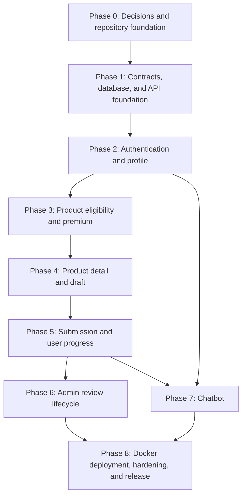

# Simple Insurance Application — Implementation Plan

## 1. Purpose

This plan breaks the approved requirements and design into an executable delivery sequence for a Next.js frontend and Node.js backend.

Planning sources:

- `docs/Simple_Insurance_App_FSD.docx`
- `docs/Simple_Insurance_App_Mini_BRD_Refined_Draft.docx`
- `docs/Mockup_Insurance.drawio.png`
- `rules.md` — authoritative business and application rules
- `design.md` — target technical design

If this plan conflicts with `rules.md`, follow `rules.md` and update this plan. If implementation constraints require changing the behavior in `design.md`, record and review the decision before coding the change.

## 2. Target outcome

Deliver an application in which:

1. A user logs in and completes a persistent master profile.
2. The user sees only compatible insurance products and server-calculated premium simulations.
3. Opening a product detail page creates no application.
4. Choosing/confirming an insurance type or changing available product-specific data creates one resumable draft containing the triggering value.
5. Apply validates and changes `DRAFT` to `SUBMITTED`, after which the application is read-only for the user.
6. A submitted application appears on the admin list with a **Start Review** action.
7. Clicking Start Review on the list changes `SUBMITTED` to `UNDER_REVIEW` and then opens the admin detail page.
8. The admin approves or rejects from the detail page; rejection requires a reason.
9. The user can track `DRAFT → SUBMITTED → UNDER_REVIEW → APPROVED | REJECTED`.
10. A scoped chatbot is available throughout authenticated user-facing pages.
11. The complete system can be started with Docker Compose and served over plain HTTP for local or trusted-network use.
12. The browser UI supports commonly used laptop/desktop operating systems and modern browsers.
13. The frontend uses Next.js, TypeScript, and Tailwind CSS; the backend uses Node.js, Express, and TypeScript.
14. Mandatory unit tests protect frontend logic, Express services/middleware, and shared domain behavior.

## 3. Planning principles

- Build in dependency order; do not start lifecycle UI before backend state guards are defined.
- Treat the Node.js backend and database as authoritative for authentication, authorization, product eligibility, premium calculation, validation, and lifecycle transitions.
- Keep business-owned rating, eligibility, currency, supplemental-field, and chatbot data configurable.
- Use MongoDB with MQL through the official MongoDB Node.js driver as the persistence technology.
- Use Express as the Node.js HTTP framework and Tailwind CSS as the Next.js styling system.
- Keep TypeScript strict but straightforward: explicit domain types, small modules, and minimal abstraction.
- Add unit tests with every behavior-bearing module; tests are part of implementation, not a final cleanup phase.
- Implement vertical slices with tests instead of completing all frontend work before backend behavior.
- Use stable shared API contracts and string enums from the beginning.
- Make every mutation safe against retries and concurrent requests before release.
- Keep only the web entry point exposed; keep the API and database on an internal Docker network.
- Treat plain HTTP as a documented demo/internal-network limitation, not as secure public-internet transport.
- Do not use placeholder insurance rules in an approved deployment.

## 4. Fixed stack and remaining decisions

The following technology choices are fixed:

| Layer | Required technology |
| --- | --- |
| Frontend | Next.js with TypeScript |
| Styling | Tailwind CSS |
| Backend | Node.js with Express and TypeScript |
| Database | MongoDB using MQL through the official Node.js driver |
| Deployment | Docker Compose |
| Tests | Mandatory automated unit tests, plus integration and end-to-end tests where planned |

Resolve and record only these remaining technical choices during project setup:

- package manager and monorepo tooling, if a monorepo is used;
- supported stable MongoDB and official Node.js driver versions, plus whether an ODM is justified;
- authentication session/token mechanism;
- frontend data-fetching and form libraries;
- unit-test runner and the API integration/browser end-to-end test frameworks;
- Docker/Compose versions, deployment environments, and secret management;
- supported runtime versions and CI commands.

Resolve these business inputs before approved or real data is enabled:

- account provisioning or credential-registration policy;
- supported currency and formatting;
- product catalog content and active versions;
- age and sum-assured eligibility rules;
- payment-frequency and payment-method compatibility;
- base premium, multipliers, discounts, quote validity, and rounding;
- product-specific fields and validation rules;
- whether the same user may hold multiple simultaneous drafts for one product;
- reviewer permissions and assignment policy;
- post-approval payment behavior;
- chatbot knowledge base, provider, escalation behavior, and retention.

Test fixtures may be used while business values are pending, but they must be clearly labelled and isolated from approved deployment configuration.

### 4.1 Required simple deployment profile

The minimum deployment uses Docker Compose and plain HTTP. This intentionally replaces the HTTPS recommendation in `design.md` only for the limited local/trusted-network deployment described here:

```text
Laptop/Desktop Browser
        |
        | HTTP :80
        v
Docker: Next.js web entry point
        |
        | internal Docker network
        +----> Docker: Node.js API
                       |
                       +----> Docker: MongoDB replica set + persistent volume
```

Deployment rules:

- `docker compose up` must start the web, API, and MongoDB services after documented environment setup.
- Only the web entry point is published to the host. API and database ports must remain private to the Docker network unless explicitly enabled for local debugging.
- The web service proxies same-origin `/api` requests to the internal API service so restrictive CORS/same-origin behavior can be used.
- The browser-facing application URL uses plain `http://` for this limited deployment profile.
- For single-computer use, bind the HTTP port to loopback (`127.0.0.1`) by default.
- For multi-computer use on a trusted LAN, bind to the approved LAN interface and restrict access with the host/network firewall or an existing VPN.
- Do not expose this HTTP-only deployment to the public internet with real credentials, personal data, or insurance data.
- HTTP provides no encryption or server identity verification. Application-layer controls reduce authorization and input-handling risk, but cannot stop a network observer from reading or altering traffic.
- If public-internet or real-customer production use is later required, HTTPS/TLS becomes a blocking prerequisite and this plan must be revised.

Limited HTTP safeguards:

- short-lived server-side sessions or short-lived tokens;
- `HttpOnly` and appropriate `SameSite` cookies when cookies are used;
- CSRF protection for cookie-authenticated mutations;
- restrictive same-origin/CORS configuration;
- password hashing, RBAC, ownership checks, validation, rate limits, and audit events;
- firewall/VPN restriction for non-loopback access;
- synthetic or non-sensitive data for demonstrations.

The cookie `Secure` attribute cannot be relied on over plain HTTP. This is an accepted limitation of this deployment profile, not a security feature.

### 4.2 Laptop/desktop compatibility target

The application is browser-based and operating-system independent within this supported matrix:

| Operating system | Supported browsers |
| --- | --- |
| Windows 10/11 | Latest two stable Chrome, Edge, and Firefox versions |
| Current supported macOS releases | Latest two stable Safari, Chrome, and Firefox versions |
| Current Ubuntu LTS and comparable desktop Linux | Latest two stable Chrome/Chromium and Firefox versions |
| Current ChromeOS | Latest stable Chrome version |

Compatibility requirements:

- responsive layouts from 1024×768 laptop screens upward;
- keyboard-accessible authentication, forms, tables, dialogs, and lifecycle actions;
- no OS-specific browser plugins or locally installed application dependency beyond a supported browser;
- graceful handling of slower devices and networks with visible loading/saving states;
- functional testing at common zoom levels and with browser text scaling;
- no guarantee for Internet Explorer, end-of-life operating systems, unsupported browser versions, or specialized embedded browsers.

“Almost all laptop/computer devices” means the supported matrix above; it does not mean every historical OS and browser combination.

### 4.3 Simple TypeScript and styling rules

- Use TypeScript in the Next.js app, Express API, database migrations, tests, and shared contracts.
- Keep TypeScript `strict` mode enabled and do not use untyped `any` to bypass domain or API validation.
- Prefer plain functions, small services, explicit interfaces/types, and simple dependency passing over elaborate inheritance, decorators, or unnecessary generic frameworks.
- Share stable DTOs and enums through the contracts package, but keep server-only models and secrets out of frontend bundles.
- Keep Express controllers thin: parse the HTTP request, call a typed service, and map the result/error to HTTP.
- Use Tailwind CSS as the primary styling method for layouts, spacing, typography, responsive states, focus states, and status presentation.
- Define a small consistent Tailwind theme/design-token set. Do not introduce a second general-purpose styling framework without an approved reason.
- Extract repeated Tailwind patterns into reusable React components; avoid unreadable duplication of long class lists.
- Unit tests must be deterministic, isolated, fast, and runnable without starting the complete Docker stack unless the subject genuinely requires MongoDB integration.

## 5. Delivery dependency map



Phases are ordered by dependency, not calendar duration. Work may run in parallel only after its required contracts and dependencies are stable.

## 6. Phase 0 — Decisions and repository foundation

### Objectives

- Establish repeatable development, test, and build workflows.
- Prevent early implementation from hardcoding unresolved business rules.

### Tasks

- [x] Record the technical choices listed in Section 4.
- [x] Establish the Next.js TypeScript web application with Tailwind CSS.
- [x] Establish the Node.js TypeScript API application with Express.
- [x] Add a shared contracts package or an equivalent API type-generation workflow.
- [x] Enable TypeScript strict mode for frontend, backend, and shared contracts.
- [x] Configure simple typed Express routing, middleware, centralized error handling, and service boundaries.
- [x] Configure the Tailwind theme, responsive breakpoints, accessible focus states, and reusable base components.
- [x] Add formatting, linting, type-checking, unit-test, unit-coverage, integration-test, and build commands.
- [x] Make unit tests and type-checking mandatory CI checks.
- [x] Configure environment-variable validation and checked-in example configuration without secrets.
- [x] Add local MongoDB as a single-node replica set and deterministic collection-validator/index migration commands.
- [x] Add multi-stage Dockerfiles for the Next.js and Node.js services.
- [x] Add a Docker Compose definition for web, API, MongoDB replica-set initialization, internal networking, and persistent database storage.
- [x] Configure the web service as the only published HTTP entry point and proxy `/api` internally.
- [x] Run application containers as non-root users with minimal runtime images.
- [x] Add `.dockerignore` files, container health checks, restart policies, and environment-based configuration.
- [x] Add CI that installs dependencies, validates formatting, lints, type-checks, tests, and builds.
- [x] Add CI container-image builds and vulnerability scanning.
- [x] Define fixture-versus-approved-deployment configuration boundaries.

### Exit criteria

- A clean checkout can run web, API, and database locally using documented commands.
- `docker compose up` starts the complete stack and exposes only the documented HTTP web port.
- CI runs the same validation used locally, including mandatory unit tests.
- Next.js renders with Tailwind CSS, and the Express health endpoint responds through the web proxy.
- Secrets and approved deployment insurance values are absent from source control.

## 7. Phase 1 — Contracts, database, and API foundation

### Objectives

- Establish canonical values, MongoDB collections/indexes, and consistent API behavior.

### Backend and database tasks

- [x] Define the canonical enums from `rules.md`: role, payment frequency, payment method, and application status.
- [x] Configure MongoDB and use MQL through the official MongoDB Node.js driver.
- [x] Create versioned, idempotent setup migrations for `users`, `masterProfiles`, `products`, `productVersions`, `applications`, `applicationStatusEvents`, and `idempotencyRecords`.
- [x] Add MongoDB `$jsonSchema` validators for BSON types, required fields, and canonical enums.
- [x] Add all required unique, compound, partial, and TTL indexes from `design.md`.
- [x] Implement repository patterns and MongoDB sessions/`withTransaction` for multi-document commands.
- [x] Configure the Docker MongoDB service as a replica set so transactions work locally.
- [x] Define UTC timestamp and decimal-safe money handling.
- [x] Add request IDs, structured error responses, and validation middleware.
- [x] Add authorization primitives for role and resource ownership.
- [x] Define the idempotency-key contract and request-fingerprint behavior.
- [x] Create deterministic development/test product fixtures with explicit test-only labels.
- [x] Implement cursor/keyset pagination for user and admin application lists.
- [x] Add narrow list projections that exclude supplemental data and submission snapshots.

### Shared contract tasks

- [x] Define request/response DTOs without exposing password hashes or internal configuration.
- [x] Define a stable error shape with error code, message, and optional field errors.
- [x] Define pagination and filtering contracts for application lists.
- [x] Ensure frontend and backend use the same canonical string enum values.

### Tests

- [x] Unit tests for Express request parsing/error mapping and each domain/service rule introduced in this phase.
- [x] Collection-validator and index-migration tests.
- [x] Tests that assert required index names, key order, uniqueness, partial filters, and TTL configuration.
- [x] `explain("executionStats")` tests/checks for user history, draft resume, admin queue, reviewer queue, and application status history queries.
- [x] Pagination tests proving stable results without deep `skip`.
- [x] Serialization tests for money, dates, and enums.
- [x] Authorization primitive tests.
- [x] Idempotency-record behavior tests.

### Exit criteria

- MongoDB collection, validator, and index migrations apply cleanly and idempotently to an empty database.
- Growth-critical application queries use their intended indexes without collection scans or blocking in-memory sorts under representative fixtures.
- MongoDB transactions pass against the Docker replica set.
- Invalid status values and inconsistent decision data cannot be stored through normal application paths.
- Shared contracts compile for both applications.

## 8. Phase 2 — Authentication and master profile

### User stories

- A user or admin can log in through the common login screen.
- A user without a complete profile is routed to profile setup.
- A returning profiled user is routed to the product catalog.
- An admin is routed to the admin application list.

### Backend tasks

- [ ] Implement secure credential verification and session/token issuance.
- [ ] Implement logout and current-account endpoints.
- [ ] Implement `GET /api/v1/me/profile`.
- [ ] Implement validated profile create/update behavior.
- [ ] Enforce positive integer age and positive decimal-safe sum assured.
- [ ] Enforce canonical frequency and payment-method values.
- [ ] Prevent users from reading or changing another user's profile.
- [ ] Add safe authentication errors that do not enumerate accounts.

### Frontend tasks

- [ ] Build the common login page with accessible validation and error states.
- [ ] Add authenticated route handling and role/profile-based redirects.
- [ ] Build the profile setup form for age, sum assured, frequency, and method.
- [ ] Build a profile view/edit page.
- [ ] Invalidate dependent catalog data after profile updates.
- [ ] Add authenticated user and admin application shells.

### Tests

- [ ] Successful and failed login.
- [ ] User/admin route separation.
- [ ] New user routed to profile setup.
- [ ] Returning profiled user routed to catalog.
- [ ] Invalid and unauthorized profile updates rejected by the API.

### Exit criteria

- All role and redirect flows work through both UI and direct API tests.
- A valid master profile persists and is returned only to its owner or an authorized admin view.

## 9. Phase 3 — Product eligibility and premium simulation

### User story

A profiled user sees only products compatible with their profile, each with a premium calculated by the backend.

### Backend tasks

- [ ] Implement active/versioned product configuration loading.
- [ ] Implement one eligibility service using age, sum assured, payment frequency, and payment method.
- [ ] Implement one decimal-safe premium service using configured rating factors and rounding.
- [ ] Use the same services for catalog, product detail, draft creation, and submission.
- [ ] Implement the eligible product catalog endpoint.
- [ ] Implement the eligible product detail endpoint with coverage, benefits, limitations, insurance-type options, premium, and supplemental schema.
- [ ] Return safe reason codes for profile-incomplete, ineligible, or unavailable products.
- [ ] Prevent client-provided premium values from becoming authoritative.

### Frontend tasks

- [ ] Build catalog loading, success, empty, incomplete-profile, and failure states.
- [ ] Display product name, insurance type, description, and formatted premium.
- [ ] Link each eligible product to its detail/application page.
- [ ] Refresh catalog results when the profile changes.

### Tests

- [ ] Eligibility boundary cases from approved fixtures.
- [ ] Frequency multiplier/discount and rounding cases from approved fixtures.
- [ ] Ineligible products excluded from catalog and inaccessible through detail endpoint.
- [ ] Frontend displays server amounts and does not recalculate authoritative premiums.

### Exit criteria

- Catalog and detail calls produce consistent eligibility and premium results for the same profile/product version.
- No approved deployment rating constant exists in frontend code.

## 10. Phase 4 — Product detail, dynamic fields, and draft lifecycle

### User stories

- A user may inspect a product without creating an empty application.
- A user's first meaningful application action creates one draft and saves that exact action.
- A user can continue, leave, resume, or delete their own draft.

### Backend tasks

- [ ] Define and validate the allow-listed dynamic-field schema primitives.
- [ ] Implement `POST /api/v1/me/applications/drafts`.
- [ ] Require a non-empty trigger of either insurance-type selection/confirmation or product-specific field change.
- [ ] Validate the trigger against the selected product version.
- [ ] Recheck current profile, eligibility, and premium during draft creation.
- [ ] Store the draft and triggering value atomically.
- [ ] Make creation idempotent for a single application initiation.
- [ ] Implement owned draft retrieval and list behavior.
- [ ] Implement versioned/conditional draft auto-save.
- [ ] Reject unknown, wrong-type, or disallowed supplemental values.
- [ ] Implement owned Draft-only deletion and exclude internally deleted records.
- [ ] Prevent admins and other users from accessing user drafts.

### Frontend tasks

- [ ] Build product detail sections: title, description, type, coverage, benefits, limitations, and premium.
- [ ] Render dynamic inputs from safe schema metadata.
- [ ] Keep the initial page in `BROWSING` state without an application ID.
- [ ] Trigger draft creation only when the user chooses/confirms type or changes a product-specific field.
- [ ] Include the triggering value in the creation request.
- [ ] For a product without supplemental fields, require explicit type/plan selection or confirmation before Apply.
- [ ] Preserve local input while draft creation is pending and merge/queue subsequent edits.
- [ ] Add `saving`, `saved`, and retryable `failed` auto-save states.
- [ ] Warn before leaving when changes are unsaved or failed.
- [ ] Build the user's application list and draft resume path.
- [ ] Add confirmed draft deletion.

### Tests

- [ ] Opening, viewing, scrolling, or leaving product detail creates no application.
- [ ] First type selection creates one draft containing the selected type.
- [ ] First supplemental change creates one draft containing the exact changed value.
- [ ] Retry/duplicate frontend behavior creates no duplicate draft.
- [ ] Auto-save version conflict does not overwrite newer data.
- [ ] Draft persists across refresh/exit and can be resumed.
- [ ] Only the owning user can edit or delete a draft.
- [ ] No draft appears in an admin query.

### Exit criteria

- Meaningful-action draft behavior passes browser and API integration tests.
- No empty draft is created from passive product-detail viewing.
- Autosave never reports Saved until persistence succeeds.

## 11. Phase 5 — Submission and user progress

### User stories

- A user applies with a valid draft.
- Invalid drafts remain editable and show useful errors.
- Submitted and later applications are read-only and track progress.

### Backend tasks

- [ ] Implement the explicit submit command endpoint.
- [ ] Verify authentication, ownership, and current `DRAFT` status.
- [ ] Recheck product availability, eligibility, premium, profile fields, and supplemental fields.
- [ ] Atomically store profile/product/premium snapshots, `submittedAt`, `SUBMITTED`, and the audit event.
- [ ] Make repeated submission with the same idempotency request safe.
- [ ] Reject user update/delete attempts from `SUBMITTED` onward.
- [ ] Return status-specific application progress data without leaking admin-only information.

### Frontend tasks

- [ ] Enable Apply only after a draft exists and no draft creation/save is pending.
- [ ] Map submission validation errors to fields and remain in Draft.
- [ ] On success, replace editable form state with the read-only Submitted view.
- [ ] Remove Apply and Delete from Submitted and later views.
- [ ] Display the required status-specific timestamps, reviewer, and rejection reason.
- [ ] Ensure status labels match the actual enum.

### Tests

- [ ] Required field failure remains Draft.
- [ ] Successful Apply creates no second application and sets `submittedAt` once.
- [ ] Submitted snapshots remain unchanged after later profile/product edits.
- [ ] Direct user API attempts cannot modify or delete a submitted/reviewed/final application.
- [ ] User progress correctly renders every lifecycle status.

### Exit criteria

- A complete user journey from profile through Submitted passes end-to-end.
- Submitted history is stable and read-only.

## 12. Phase 6 — Admin application review

### User stories

- An admin sees all and only non-draft applications.
- An admin starts review explicitly from a Submitted row on the list.
- Start Review completes before the UI opens the detail page.
- An admin approves or rejects an Under Review application from its detail page.

### Backend tasks

- [ ] Implement the admin list query limited to `SUBMITTED`, `UNDER_REVIEW`, `APPROVED`, and `REJECTED`.
- [ ] Include Applicant Name, Date Applied, Insurance Type, Payment Frequency, Status, and optional Product Name.
- [ ] Implement combined read-only admin detail and separate master-profile endpoints.
- [ ] Implement the explicit Start Review command with conditional `SUBMITTED → UNDER_REVIEW` update.
- [ ] Record reviewer identity, `reviewStartedAt`, and status event atomically.
- [ ] Implement conditional `UNDER_REVIEW → APPROVED` with `approvedAt`.
- [ ] Implement conditional `UNDER_REVIEW → REJECTED` with trimmed non-empty reason and `rejectedAt`.
- [ ] Reject skipped, repeated, stale, concurrent, or terminal-state transitions with `409`.
- [ ] Ensure reading detail never causes a transition.

### Frontend tasks

- [ ] Build the admin list and required columns.
- [ ] Show Start Review only for `SUBMITTED` rows.
- [ ] Optionally show a separate View action for every non-draft row.
- [ ] On Start Review, wait for API success and then navigate to the detail page.
- [ ] Do not transition when View, direct URL, or refresh opens a Submitted detail page.
- [ ] Build the read-only joined detail view and status history.
- [ ] Show Approve and Reject only for `UNDER_REVIEW`.
- [ ] Require and validate rejection reason in the UI.
- [ ] Refresh stale list/detail state after a `409 Conflict`.
- [ ] Link applicant name/photo to the separate master-profile view.

### Tests

- [ ] Drafts absent from admin list, counts, searches, and detail access.
- [ ] Submitted row shows Start Review; other statuses do not.
- [ ] Start Review changes status, records reviewer/time, and then opens detail.
- [ ] View/direct URL/refresh does not change Submitted status.
- [ ] Approve and Reject are accepted only from Under Review.
- [ ] Empty/whitespace rejection reason is rejected by UI and API.
- [ ] Competing admin transitions produce one committed result and one conflict.
- [ ] Approved and Rejected remain terminal.

### Exit criteria

- The full state machine passes API and end-to-end tests.
- No read request has lifecycle side effects.
- Every committed transition has an audit event and required actor/timestamp data.

## 13. Phase 7 — AI chatbot

### User stories

- An authenticated user can open a chatbot from every user-facing page.
- The chatbot answers grounded insurance/status questions without exposing other users or changing applications.

### Tasks

- [ ] Confirm provider, knowledge base, approved content, retention, and fallback/escalation behavior.
- [ ] Add the persistent launcher to the authenticated user shell.
- [ ] Implement the scoped chat endpoint and provider adapter.
- [ ] Retrieve only knowledge-base content and the minimum authorized current-user status context.
- [ ] Prevent the chatbot from invoking application mutations.
- [ ] Add unsupported-question and provider-failure responses.
- [ ] Add authentication, rate limiting, safe logging, and abuse controls.

### Tests

- [ ] Widget appears across authenticated user routes.
- [ ] Admin/public pages follow the agreed visibility scope.
- [ ] User cannot retrieve another user's status through chat.
- [ ] Prompt injection cannot grant admin context or mutation capability.
- [ ] Unknown answers are acknowledged rather than invented.

### Exit criteria

- Security and content review approve the integration.
- Chat failures do not block the core insurance application flow.

## 14. Phase 8 — Docker deployment, hardening, and release

### Security and reliability tasks

- [ ] Perform an authorization review of every endpoint and database query.
- [ ] Add CSRF protection where cookie authentication is used.
- [ ] Add login/chat rate limiting and safe output rendering/sanitization.
- [ ] Configure restrictive same-origin/CORS behavior and short session lifetime for the HTTP-only profile.
- [ ] Verify loopback binding for local use and document firewall/VPN restriction for trusted-LAN use.
- [ ] Display/document that the HTTP deployment must not carry real sensitive data over an untrusted network.
- [ ] Verify secrets, passwords, tokens, and sensitive form values are not logged.
- [ ] Add request correlation IDs and structured operational logging.
- [ ] Add metrics/alerts for errors, draft-save failures, rating failures, submissions, and admin transitions.
- [ ] Load-test catalog, auto-save, application lists, and concurrent transitions.
- [ ] Define backup, recovery, retention, and deletion procedures.
- [ ] Verify accessibility for authentication, forms, dynamic fields, tables, dialogs, and status feedback.
- [ ] Run the browser compatibility matrix on Windows, macOS, Linux, and ChromeOS targets available to the team.
- [ ] Test responsive behavior from 1024×768 upward and at common browser zoom/text scaling levels.

### Release tasks

- [ ] Replace all test product/rating data with approved deployment configuration where the environment is authorized for it.
- [ ] Build and vulnerability-scan the final Docker images.
- [ ] Start a clean environment using only the documented Docker Compose workflow.
- [ ] Verify only the web HTTP port is published; API and database remain on the internal network.
- [ ] Verify container health checks, restart behavior, MongoDB persistence, collection/index migrations, backup, and recovery.
- [ ] Apply MongoDB collection-validator and index migrations in a deployment-like staging environment.
- [ ] Run the complete unit, integration, and end-to-end suites.
- [ ] Run cross-browser smoke tests from at least one supported Windows, macOS, and Linux/ChromeOS environment.
- [ ] Execute user and admin acceptance walkthroughs.
- [ ] Verify rollback and recovery procedures.
- [ ] Record known limitations and operational ownership.
- [ ] Record explicit acceptance of the plain-HTTP limitation and restrict the deployment to local/trusted-network use.
- [ ] Obtain business approval for eligibility, premiums, field schemas, and displayed policy content.

### Exit criteria

- All release gates in Section 16 pass.
- No unresolved critical/high security or data-integrity issue remains.
- Business owners approve the insurance configuration used in the authorized environment.
- The HTTP-only deployment is not represented as secure for public-internet transmission of real customer data.

## 15. Requirement-to-delivery traceability

| Requirement | Primary phase | Verification |
| --- | --- | --- |
| Express Node.js API | Phase 0 onward | API unit/integration tests and health check |
| Next.js with Tailwind CSS | Phase 0 onward | Component tests and responsive browser checks |
| Simple strict TypeScript | Every phase | Type-checking and code review |
| Mandatory unit tests | Every phase | CI unit-test and coverage reports |
| Common login and role routing | Phase 2 | Auth integration and E2E tests |
| Master profile | Phase 2 | Profile API/UI tests |
| Product matching | Phase 3 | Eligibility unit/integration tests |
| Premium simulation | Phase 3 | Rating unit and catalog E2E tests |
| Dynamic supplemental fields | Phase 4 | Schema renderer/validator tests |
| Meaningful-action Draft trigger | Phase 4 | API and browser tests |
| Draft auto-save/resume/delete | Phase 4 | Concurrency, ownership, and E2E tests |
| Apply and lock application | Phase 5 | Transaction/idempotency and E2E tests |
| User progress tracking | Phase 5 | Status rendering tests |
| Admin non-draft list | Phase 6 | Query and E2E tests |
| Start Review on admin list | Phase 6 | Transition/navigation E2E test |
| Approve/Reject detail actions | Phase 6 | State-machine and rejection tests |
| AI chatbot | Phase 7 | Scope, grounding, and security tests |
| Plain-HTTP limited deployment | Phases 0 and 8 | Network exposure and risk-acceptance checks |
| Docker deployment | Phases 0 and 8 | Clean Compose startup and recovery test |
| Laptop/desktop OS compatibility | Phase 8 | Supported-browser matrix and responsive tests |
| MongoDB and growth indexes | Phases 1 and 8 | Index-definition and `explain()` checks |
| Audit, security, release readiness | Phase 8 | Release checklist and review |

## 16. Release gates

### Gate A — Functional correctness

- [ ] The backend is implemented with Express and TypeScript.
- [ ] The Next.js frontend uses Tailwind CSS as its primary styling system.
- [ ] Strict TypeScript type-checking and all mandatory unit tests pass.
- [ ] Every end-to-end acceptance scenario in `rules.md` passes.
- [ ] The user and admin workflows match `design.md`.
- [ ] Product opening does not create an empty draft.
- [ ] Start Review is an explicit list action, not a read side effect.

### Gate B — Data integrity

- [ ] Money is decimal-safe and submitted snapshots are immutable.
- [ ] Submission and lifecycle transitions are transactional.
- [ ] Idempotent retries do not duplicate drafts or submissions.
- [ ] Stale/concurrent changes return conflicts instead of overwriting data.
- [ ] Status-specific timestamps and rejection reason invariants hold.
- [ ] User/admin application queries use the required MongoDB indexes and cursor pagination under representative growth data.

### Gate C — Security and privacy

- [ ] All role and ownership tests pass through direct API calls.
- [ ] Drafts are inaccessible to admins and other users.
- [ ] Sensitive values are excluded from logs and client configuration.
- [ ] Chatbot context is restricted to the authenticated user's authorized data.
- [ ] HTTP is bound to loopback or restricted to an approved trusted LAN/VPN with firewall rules.
- [ ] No real sensitive data is sent over the HTTP-only deployment on an untrusted network.
- [ ] Stakeholders acknowledge that application controls do not provide encryption in transit.

### Gate D — Operational readiness

- [ ] Docker Compose starts the entire system from documented configuration.
- [ ] Only the web HTTP port is published; API and database are internal.
- [ ] MongoDB replica-set health and transaction behavior are verified.
- [ ] Container image scans, health checks, non-root execution, persistence, and restart behavior pass.
- [ ] CI, collection/index migrations, backups, monitoring, alerts, and rollback are verified.
- [ ] The supported desktop browser/OS matrix passes.
- [ ] Approved deployment business configuration is loaded.
- [ ] Support ownership and known limitations are documented.

## 17. Definition of done for every implementation task

A task is done only when:

- implementation matches `rules.md` and the relevant `design.md` section;
- behavior-bearing TypeScript code has focused unit tests and the complete unit suite passes;
- implementation remains straightforward and does not add unneeded abstraction or styling frameworks;
- backend authorization and validation exist even if the UI hides invalid actions;
- success, loading, empty, validation, authorization, conflict, and server-error behavior are handled where relevant;
- unit/integration/end-to-end tests proportional to the risk are added and passing;
- API contracts and migrations are updated when applicable;
- accessibility and sensitive-data logging are considered;
- relevant supported desktop browsers and responsive layouts are verified;
- Docker build/runtime changes are tested through Compose where applicable;
- no test-only insurance value is presented as approved deployment policy;
- documentation is updated if behavior or a technical decision changed.

## 18. Completion checklist

- [x] Phase 0 complete — project foundation
- [x] Phase 1 complete — contracts and persistence
- [x] Phase 2 complete — authentication and profile
- [x] Phase 3 complete — product matching and premium
- [x] Phase 4 complete — product application and draft
- [x] Phase 5 complete — submission and user progress
- [x] Phase 6 complete — admin lifecycle
- [x] Phase 7 complete — chatbot
- [ ] Phase 8 complete — Docker deployment, hardening, and release
- [ ] All release gates passed
- [ ] Final stakeholder acceptance recorded
